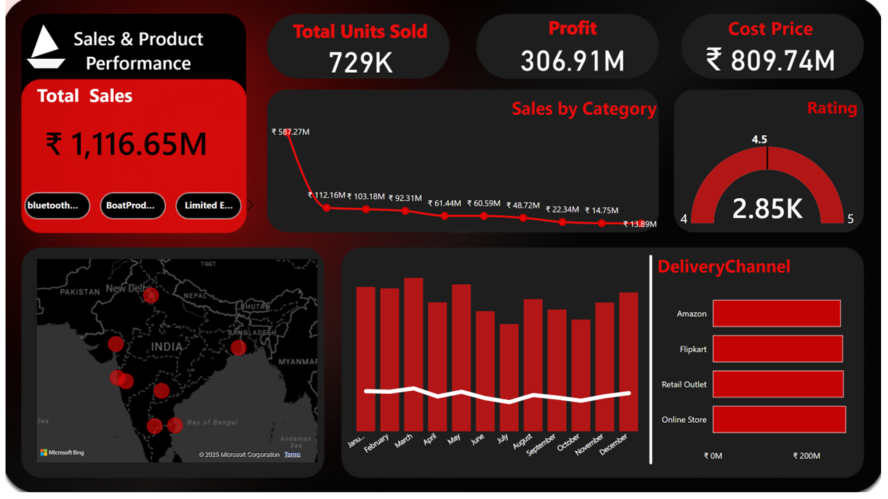

# 📊 Boat-powerbi-dashboard – Power BI



## 📌 Project Overview
This project is a **Power BI Dashboard** built to visualize **boAt’s Financial & Sales Data** in a visually appealing and interactive way.  
It helps analyze **sales performance, profit margins, delivery channels, product categories, and customer ratings** at a glance.

---

## 🎯 Key Features
✅ **Total Sales, Profit & Cost KPIs** – Quick insight into company performance  
✅ **Sales by Category** – Identify top-performing product categories  
✅ **Customer Ratings** – Visual gauge to monitor customer satisfaction  
✅ **Delivery Channel Analysis** – Compare sales via Online Store, Flipkart, Amazon, and Retail Outlets  
✅ **Monthly Trend Analysis** – Track sales patterns over the year  
✅ **Geo Map Visualization** – Locate sales distribution across India  

---

## 🛠 Tools & Technologies Used
- **Power BI Desktop** (for dashboard creation)
- **Microsoft Excel** (for data preparation)
- **DAX** (for measures and calculated columns)
- **Figma** (for custom dashboard background design)

---

## 📂 Dataset
The dataset contains:
- **Sales Data** (Amount, Category, Month)
- **Profit & Cost**
- **Delivery Channel**
- **Customer Ratings**
- **Geo-location for Mapping**

---

## 📸 Dashboard Pages
1️⃣ **Home Page** – Project title & navigation buttons  
2️⃣ **Sales & Product Performance** – Total sales, profit, cost, delivery channel breakdown  
3️⃣ **Customer Data** – Age groups, gender split, customer count trends  
4️⃣ **Financial Overview** – Revenue, cost, and profit analysis with visuals  

---

## 🚀 How to Use
1. Clone this repository:
   ```bash
   git clone https://github.com/<your-username>/<your-repo-name>.git
   ```
2. Open the **Power BI (.pbix)** file in **Power BI Desktop**.
3. Connect to the dataset if needed.
4. Explore different pages using the navigation buttons.

---

## 📊 Dashboard Preview


---

## 🤝 Contributing
Pull requests are welcome!  
If you’d like to improve the dashboard visuals or add more KPIs, feel free to fork and contribute.

---

## 📜 License
This project is licensed under the **MIT License** – you are free to use, modify, and distribute.

---

## 👨‍💻 Author
**Aniket Harishchandra Gupta**  
- [Portfolio](https://aniket-portfolio149.web.app/)  
- [LinkedIn](https://www.linkedin.com/in/aniket-gupta-b44611261)  
- [GitHub](https://github.com/Aniketgupta149)
